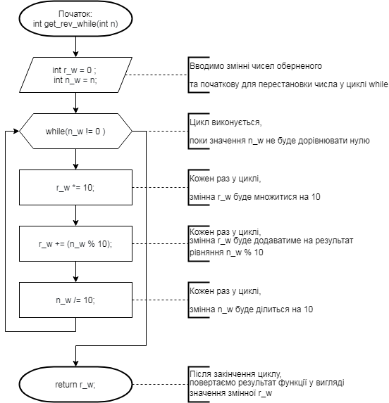
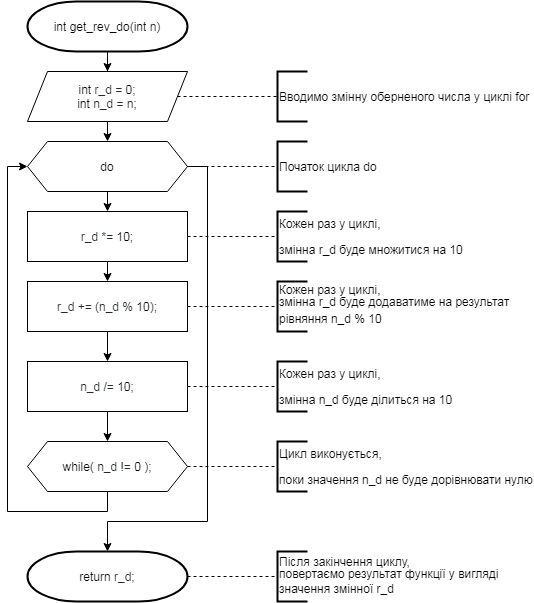
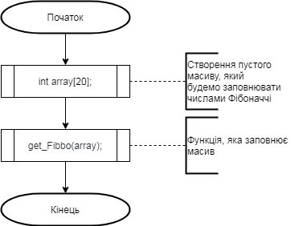
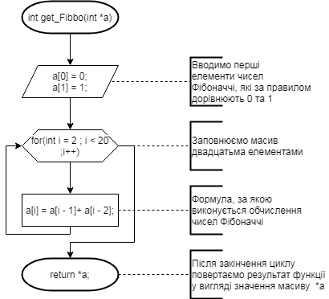

# **Лабораторна робота №8. Вступ до блок-схем алгоритмів.**

# **Лабораторна робота №9. Вступ до документації коду(частина 1).**

# **Лабораторна робота №10. Вступ до документації проекту.**

## Індивідульне завдання на оцінку “добре” номер 2.

1.	**Вимоги**  
	1.Розробник  
	- Князькін Владислав Ігорович  
	- студент групи КІТ-320  
	- 11.12.20  
		
	2.*Загальне завдання*  
	*Розробити повноцінний звіти для лабораторної роботи “Функції”, що присвячена функціям у двох форматів (+їх презентація у PDF форматі)  
		
	3.*Індивідуальні завдання*  
	 - Переробити програми, що були розроблені під час виконання лабораторних робіт з тем “Масиви” та “Цикли” таким чином, щоб використовувалися функції для обчислення результату.  
	Функції повинні задовільняти їхню причетність — уникати дублювання коду. Тому, для демонстрації роботи, ваша програма(функція main()) повинна викликати декілька раз розроблену функцію з різними вхідними даними.  
	- **Слід звернути увагу**: параметри одного з викликів функції повинні бути згенерованя за допомогою генератора псевдовипадкових чисел rand().  

2.	**Хід роботи**  
	1.	Зробимо у раніше створеному репозиторії нову під-директорію *`lab08_09_10`*:  
	```valadon@valadon-VirtualBox:~ PROGRAMMING-KNIAZKIN $ mkdir lab08_09_10```  
	2.	Cкопіюємо роботи з лабораторних робіт №5 та №6, *task02_5* *task02_6* аналогічно:  
	```valadon@valadon-VirtualBox:~ PROGRAMMING-KNIAZKIN/ $ cp -r lab07/task02_5 lab08_09_10```  
	```valadon@valadon-VirtualBox:~ PROGRAMMING-KNIAZKIN/ $ cp -r lab07/task02_6 lab08_09_10```  
	3.	Перейменовуємо роботи у *lab02_5*,  *lab02_6*. Переглянемо наші програми у вигляді блок-схем алгоритмів.  
	Спочатку — розберемо *lab02_5*:  
	-	*Функція main()*:  
	  
	Усі три функції, а саме *get_rev_for*, *get_rev_while* та *get_rev_do*, виконують одну й теж саму дію, але розроблені вони на основі відомих для нас, мовою програмування C, циклів **For**, **While_Do** та **Do_While** відповідно.  
	Розглянемо кожну функцію на основі кожного з вище перерахованих циклів, у виді блок-схем алгоритмів.  
	-	*Функція int get_rev_for(int n)*:  
	  
	-	*Функція int get_rev_while(int n)*:  
	  
	-	*Функція int get_rev_do(int n)*:  
	  
	Розберемо lab02_6:  
	-	*Функція main()*:  
	  
	У цій програмі, ми створюємо функцію **get_Fibbo**, яка має заповнювати наш масив, за формулою для розрахунку елементів цілих чисел Фібоначчі.  
	-	*Функція int get_Fibbo(array)*:  
	  
	4)	Повертаємось до терміналу, щоб перевірити якість роботи наших програм. Звернемо увагу на те, що у відлагоднику ми не бачимо дії власних функцій, але бачимо результат, завдяки діям return, які повертають результат функцій до змінних, які ми вказали.```gcc -g main.c 	//* Зробимо виконувальні файли для наших main.c```  
	       Вони автоматично назвуться ```a.out```  
	5)	Запускаємо відлагодник `nemiver`, щоб перевірити, як працює наша програма. Щоб запустити програму, треба запустити її через виконувальний файл:  
	-	Відкриваємо `Файл`
	-	Знаходимо фунцію `Завантажити виконувальний файл...`
	-	Вибираємо програму `a.out` у нашому каталозі
	-	Натискаємо `Виконати`.
	Тепер можна побачити програму, яку ми написали раніше:  
       Завдяки функції “Step over”, переводимо нашу “стрілку” до останнього рядка ,щоб перевірити результат команди.  
       -	*Програма task02_5*:  
         
       -	*Програма task02_6*:  
         
       6)	Бачимо, що результат вірний. Видалимо a.out. Збережемо зміни у нашій директорії на github через команди git:  
	```valadon@valadon-VirtualBox:~ PROGRAMMING-KNIAZKIN/naxxramass $ git add .```  
	```valadon@valadon-VirtualBox:~ PROGRAMMING-KNIAZKIN/naxxramass $ git status```  
	  
	```valadon@valadon-VirtualBox:~ PROGRAMMING-KNIAZKIN/naxxramass $ git commit -m “Create lab08_09_10”```  
	```valadon@valadon-VirtualBox:~ PROGRAMMING-KNIAZKIN/naxxramass $ git push```  
	  
3.	**Способи використання**  
	Щодо функцій, вони допомагають скоротити код та уникнути його повторень.  
	Щодо програми, завдяки їй можна визначити наступне та попереднє числа заданого цілого числа, а також кількість елементів що більше та менше заданого.
4.	**Структура програми**:  
```
.
|--doc
|--assets
|||--1_2.png
|||--2.png
|||--3.png
|||--4.png
|||--get_fibbo.png
|||--get_rev_do02_5.png
|||--get_rev_while02_5.png
|||--get_rev_for02_5.png
|||--main02_5.png
|||--main02_6.png
||--lab08_09_10.doc
||--lab08_09_10.pdf
||--lab08_09_10.md
|--task02_5
||--src
|||--main.c
||--README.md
|--task02_6
||--src
|||--main.c
||--README.md
|--DoxyFile
|--Makefile
|--README.md

```

#	**Висновок**
Завдяки цій лабораторній роботі, я навчився переробляти програми таким  чином,щоб використовувалися функції для обчислення результату, на язику C, у системі Linux,  
додавати до них коментарі, перевіряти програму на дієздатність у відлагоднику (nemiver),та відправляти зміни у свій репозиторій на github.  
	
